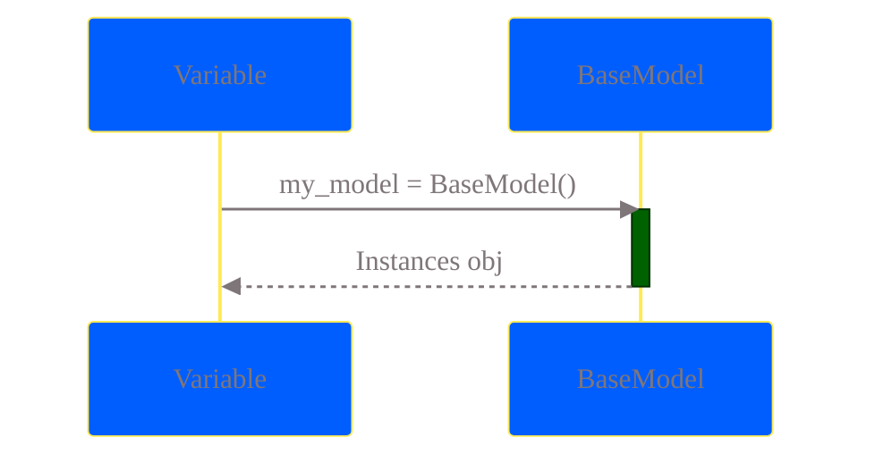
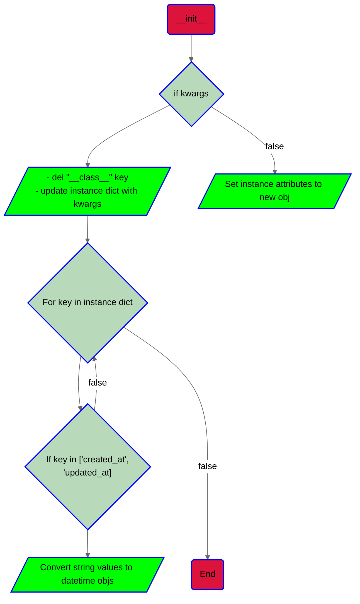
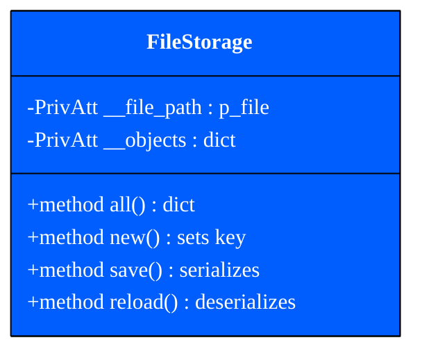
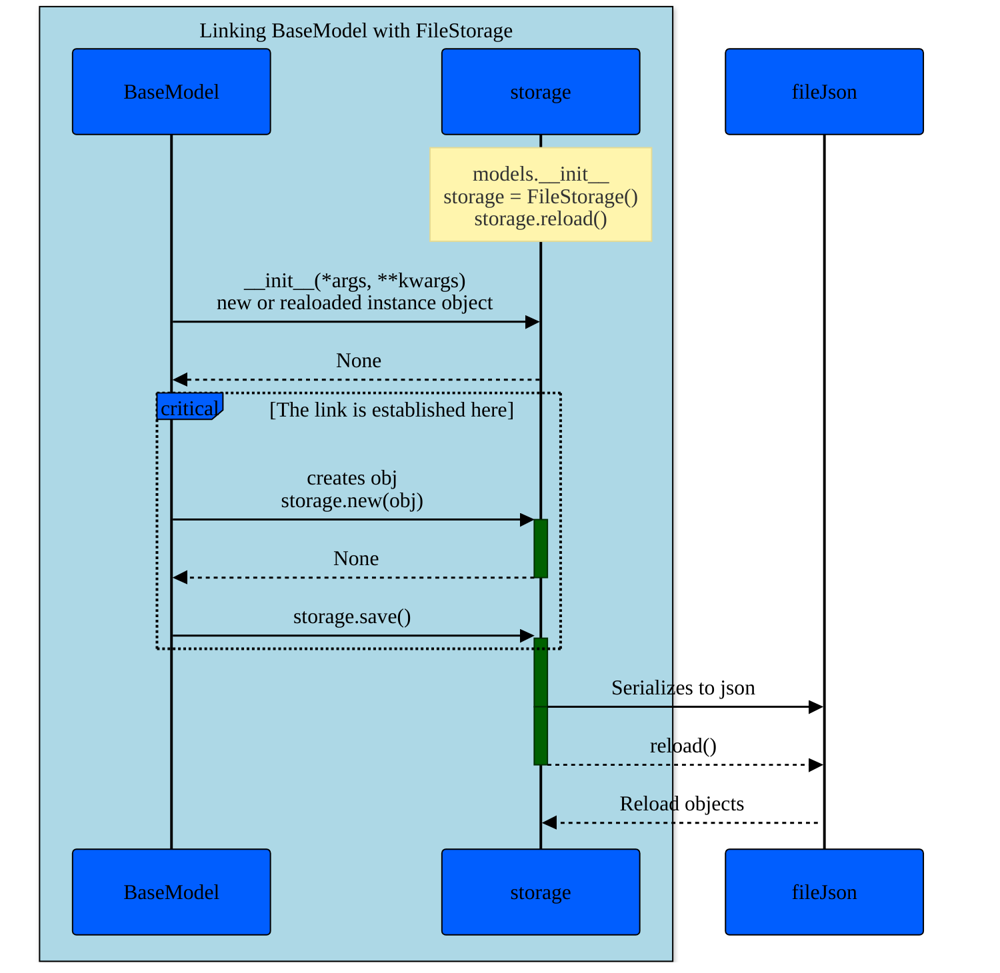

# New Repository AirBnB Clone (solo)
> **_NOTE:_** If you find this repository interesting, please leave a star, it would motivate me for sure :)
# contributor: Kevin Espinoza Salguedo

## Creating the first BaseModel Class

This part of the project focus on the creation of the main class named BaseModel, this class will contain all common
attributes and modules for other classes.

At this point you can create instances of the base class, the instance will inherit all the attributes and methods
of the base class and also can get new attributes by manipulating the instance.

```py
from models.base_model import BaseModel
# creating te instance
my_model = BaseModel()
# Adding new values
my_model.number = 86
# watch for format
my_model.to_dict()
```
Output:

```bash
{'id': 'ba725e96-5756-4051-97ce-bf03b339c3ee', 'created_at': '2024-03-23T18:31:25.358680', 'updated_at': '2024-03-23T18:31:25.358680', 'number': 86, '__class__': 'BaseModel'}
```

### Class Diagram BaseModel Test.
 ```mermaid
 classDiagram
  class BaseModel{
    +PubAtt id = str
    +PubAtt created_at = obj
    +PubAtt updated_at = obj
    +method special __str__() str
    Save() obj
    +method to_dict() str
  }
style BaseModel stroke:#000,stroke-width:6px


  %%{
  init: {
    'theme': 'base',
    'themeVariables': {
      'primaryColor': '#005eff',
      'primaryTextColor': '#fff',
      'primaryBorderColor': '#000',
      'lineColor': '#000000',
      'secondaryColor': '#006100',
      'tertiaryColor': '#fff',
      'fontFamily': ''
    }
  }
}%%

<<Abstract>> BaseModel
 ```
> **_NOTE:_** As you can see in the class diagram the following public attributes "created_at" & "updated_at" are datetime objects (internally), we need to take care of this objects when printing the instance format, so inside the method  to_dict() we need to implement the logic to target those objects and convert those to strings.


## Managing instance from kwargs

This part of the poject will use a dictionary as an imput to instance the base class
so what we need to do is update the init method to manage arguments.

```py
def __init__(self, *args, **kwargs):
  # logic
```
```py
# test case

my_model = BaseModel()
my_model_json = my_model.to_dict()

# instancing from dictionary
my_new_model = BaseModel(**my_model_json)
```
certainly this diccionary is an input, it has it's own key, values,
we can either choose treat the kwargs or directly update the instance dictionary

> **_NOTE:_** Remember the previous note ("created_at and updated_at"), the logic to manage kwargs needs to be according to the rules implemented inside the instance; inside  the instance we work usisng datetime objects, so we need to convert those kwrags attributes that requieres this logic.<br>Also remember that the kwargs will have it's own types according to the to_dict() method

## Creating an instance of BaseModel()
```py
from models.base_model import BaseModel

my_model = BaseModel()
```

> **_NOTE:_** The diagram shows the creating process of an instance from the `BaseModel` class.<br> 1. The user defines a variable named `my_model`<br>2. A new instance of the `BaseModel` class is assigned to the variable `my_model`<br>3. Instance is created<br>4. Returns an instance with attributes to the `my_model` variable


## Creating an instance of BaseModel using kwargs

```py
from models.base_model import BaseModel

my_model = BaseModel()
my_model_json = my_model.todict()
my_new_model = BaseModel(**my_model_json)
```


> **_NOTE:_** The flowchart represents the instance when it is created from a dictionary, json representation, and manages the logic to convert some values to it's roots(former instance attributes).

## Serialization and Deserialization

In this part of the project we are going to start writing a new class named `FileStorage` this class will do the job.
As we can see, everytime the test case ends, the objects dissapear, that is something that we don't want, so this class will help us to save and track every object that is instanced.
**Well lets define  `FileStorage` class**


## Linking BaseModel to FileStorage

Now that we define the FileStorage() class we need to link it to the BaseModel() class to really save objects in a file, this file  will
containg json representation of the objects and will work as a storage for every object that is intanced.

** Well Let's define the link between those classes**


> **_NOTE:_** This sequence diagram represents how a link is established between `BaseModel` and `FileStorage` and how this object is saved when creating a new instance or reloaded from kwargs


# Contact

<p align="center">
  
  <br>
  <a href="https://github.com/KevinYeff"><h>Kevin Espinoza</h></a>
</p>

<p align="center">
<a href="https://twitter.com/missingyeff" target="blank"></a>
<a href="https://www.linkedin.com/in/kevin-espinoza-salguedo-81a0a223b/" target="blank"></a>
<a href="https://github.com/KevinYeff" target="blank"></a>

</p>